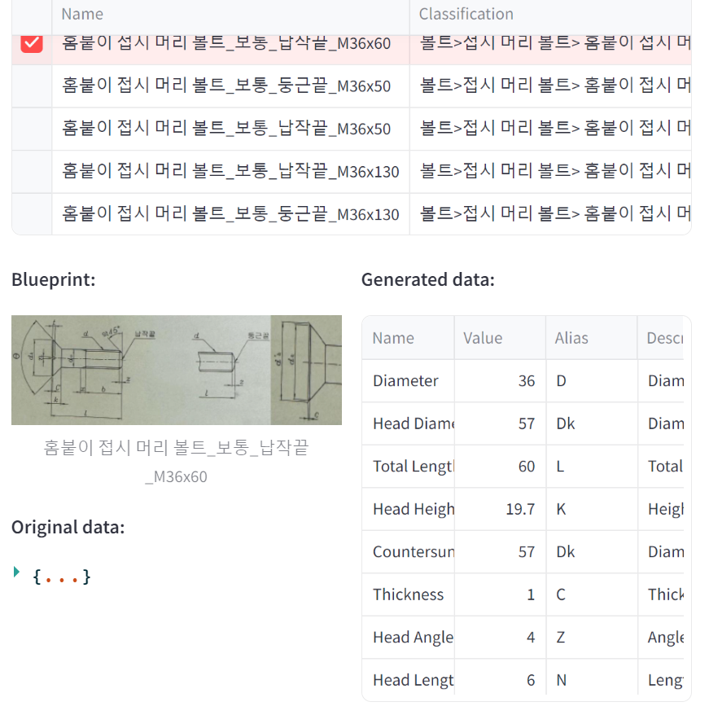
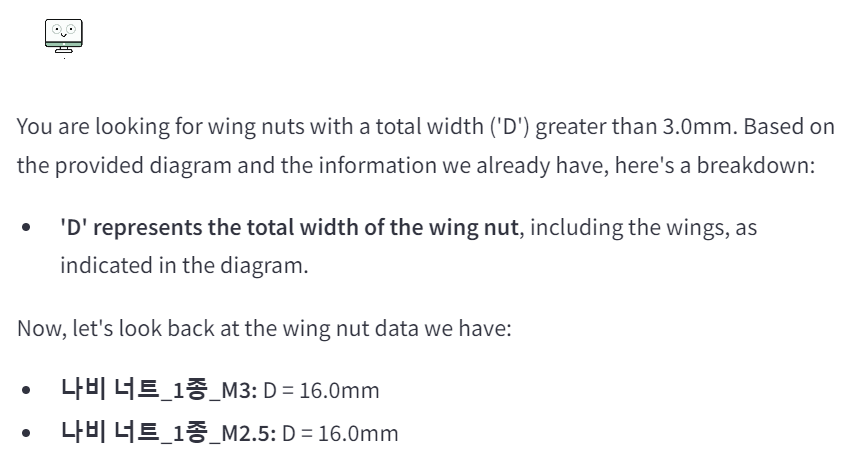

# 🎨 PartFinder-ai

제조 부품 검색의 비효율성 해결하기 위해, 도면과 메타데이터를 멀티모달 임베딩한 문서를 사용하는 RAG 시스템입니다.

## 🎬 Demo

<details>
    <summary><strong>Interface</strong></summary>
    <ul>
        
    </ul>
</details>
<details>
    <summary><strong>Only text query</strong></summary>
    <ul>
        
        
        
        
    </ul>
</details>
<details>
    <summary><strong>Image & text query</strong></summary>
    <ul>
        
        
        
        
    </ul>
</details>
<details>
    <summary><strong>Structure</strong></summary>
    <ul>
        
    </ul>
</details>

## 📌 Index
1. [Introduction](#-introduction)
2. [Caution](#️-caution)
3. [Features](#-features)
4. [Approach](#-approach)
5. [Install](#-install)
6. [How to use](#-how-to-use)
7. [Contact](#-contact)

## 🚀 Introduction
PartFinder-AI 프로젝트는 제조업체 및 기술 지원팀을 위한 흥미로운 솔루션입니다. 

현대 제조 산업에서는 **다양한 도면과 수치 알파벳의 혼재로 인해 제조 부품을 효율적으로 검색하는 데 많은 어려움을 겪고 있습니다.** 이러한 문제는 특정 수치의 부품을 검색하는 데 주요한 제약으로 작용하며, 비전공자는 이를 해석하고 정확한 부품을 찾는 데 어려움을 겪습니다. 예를 들어, 동일한 'D'라는 수치 알파벳이 도면마다 길이, 직경, 넓이 등 다양하게 해석될 수 있습니다.

이 시스템은 도면, 메타데이터, 그리고 AI 기술을 활용하여 **제조 부품에 대한 검색 혹은 질문에 신속하고 정확한 답변을 제공**합니다. RAG(Retrieval-Augmented Generation) 기술을 기반으로 하여 사용자 질의에 대해 맞춤형 응답을 생성하여 제조 프로세스의 효율성을 향상시킵니다.

## ⚠️ Caution
- 제조 부품 데이터는 보안에 민감하기 때문애, **최소한의 test data와 저품질 도면만 공유**합니다.
- 당신이 가진 제조 부품 데이터를 추가하여 사용하세요.
- **Demo는 최소한의 내부 저품질 데이터셋(저품질 도면 12개와 제조 부품 약 500개)로 테스트한 결과**입니다.
- 데이터가 많을수록 성능이 좋아질 것입니다.

## 💡 Features
### 1. 도면 기반 질의 응답
- 제품 도면과 함께 질의가 가능합니다.
- 도면 이미지와 도면 묘사를 통한 고급 검색 및 질의 기능이 제공됩니다.
- 기존 DB 쿼리 방식을 넘어선 흥미로운 제조부품 검색 솔루션입니다.

### 2. LLM 기반 자연어 처리
- 유연한 언어 입력으로 검색이 가능합니다. (예: "직경 3cm" ≈ "길이 3cm")
- 정확한 전문 용어 없이도 효과적인 검색을 지원하기에 비전문가도 쉽게 사용할 수 있습니다.

### 3. 지식 베이스 구축
- 새로운 제조부품 정보를 쉽게 업데이트 및 통합할 수 있습니다.
- 엑셀 파일과 도면 이미지가 필요합니다.

### 4. RAG 시스템
- 할루시네이션 감소를 위한 LLM 기술 적용이 필요합니다.
- 민감한 제조부품 데이터에 대한 높은 정확성 보장합니다.
- 신뢰할 수 있는 정보 제공 시스템

### 5. GUI 인터페이스
- Streamlit으로 GUI를 제공합니다. 비전문가도 쉽게 사용할 수 있습니다.

## 🛠 Approach
### 1. Background: 문제 인식


현대 제조업체 및 기술 지원 팀은 제품 부품에 대한 정확하고 신속한 정보 접근이 중요합니다. 그러나 다음과 같은 문제점들이 있습니다:

- **정보 분산**: 도면, 메타데이터, 텍스트 문서 등의 정보가 분산되어 있어 검색 및 접근이 어렵습니다.
- **시간 소모**: 사용자가 필요로 하는 정보를 찾는 과정이 수작업이거나 복잡하여 시간이 많이 소요될 수 있습니다.
- **정보 오류**: 다양한 소스로부터 수집된 정보의 일관성과 정확성을 유지하는 것이 어렵습니다.
- **전문 지식 의존성**: 복잡한 제품 정보를 이해하고 해석하는 데 전문가의 개입이 자주 필요합니다.
- **실시간 업데이트 부족**: 제품 정보가 빠르게 변경될 수 있지만, 기존 시스템은 이를 신속하게 반영하지 못합니다.

제조업 분야에서는 복잡한 부품 정보에 대한 신속하고 정확한 접근이 필요합니다. 기존의 검색 시스템은 종종 부정확하거나 시간이 많이 소요되어 생산성 저하의 원인이 되었습니다.

### 2. Solution: Multimodal embedding document

- **Multimodal embedding**: **제품 도면과 상세 메타데이터를 하나의 임베딩 벡터에 통합**하여 보다 유연한 검색 문서를 마련합니다.
- **Few shot prompt engineering**: LLM의 결과물을 적절한 형태의 응답으로 유도하여, **도면과 메타데이터의 정보손실을 최소화**합니다.
- **RAG application**: 벡터 DB에 저장된 정보를 효과적으로 검색하고 retrieve된 문서와 유저의 쿼리를 기반으로 새로운 응답을 생성합니다.
- **LLM chat**: LLM의 유연한 언어능력을 기반으로 **다양한 도메인(전문가, 비전문가 etc)의 쿼리를 통합적으로 처리**합니다.

### 3. Solution: Template generate and insert workflow
- **Time consuming of LLM**: 하나의 제조 부품에 대한 지식 기반을 LLM을 통해 생성하는데 걸리는 평균 시간은 12초입니다. 그래서 모든 제조 부품에 LLM을 적용하기에는 현실적으로 어렵습니다.
- **Template generation**: 도면과 제조 부품의 관계는 1:1 관계가 아닌 1:N 관계(많은 경우 1:500↑)입니다. **도면의 수치가 alphabet alias라면, 맵핑된 수치를 조정하면서 부품을 생산하는 방식**입니다. 따라서 도면과 alphabet alias를 기반으로 한 Template생성은 효율적입니다.
- **Insert specific data for each part**: LLM이 Template을 생성하면 제조 부품 메타데이터를 규칙에 맞게 삽입합니다. 이로 인해 지식기반 생성에 시간과 비용을 획기적으로 줄일 수 있습니다.

## 📥 Install
```bash
# 저장소 클론
git clone {this repository}
cd PartFinder-ai

# 가상 환경 생성 및 활성화
conda create -n partfinder python=3.11
conda activate partfinder

# 필요한 패키지 설치
pip install -r requirements.txt

# 환경 변수 설정
cp .env.example .env
# .env 파일을 열어 필요한 API 키와 설정을 입력하세요
vim .env
```

## 🖥 How to use
### Update Vector DB
1. `data/data_example.ods`를 참고하여 메타데이터를 엑셀로 저장
2. `.env` 파일에 메타데이터 파일과 도면 이미지 폴더 경로를 입력
    ```
    GOOGLE_API_KEY=YOUR_API_KEY
    DATA_PATH=./data/data_example.ods
    BLUEPRINT_DIR=./data/bps
    ```
3. `add_data.py` 실행
    ```bash
    python add_data.py
    ```
4. Chroma DB에 해당 데이터가 저장
    - 중복 검사(hash)가 자동으로 실행
    - 도면과 데이터가 LLM으로 재맥락하여 저장

### Run GUI
1. GUI app 실행
    ```bash
    streamlit run app.py
    ```
2. 인터페이스에서 제품 부품에 대한 질문 입력
3. 필요한 경우 관련 도면 이미지 업로드
4. 'Enter' 후 응답 확인

## 📞 Contact
middlek - middlekcenter@gmail.com
